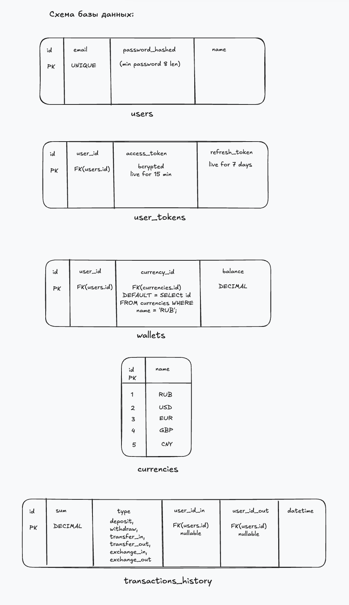
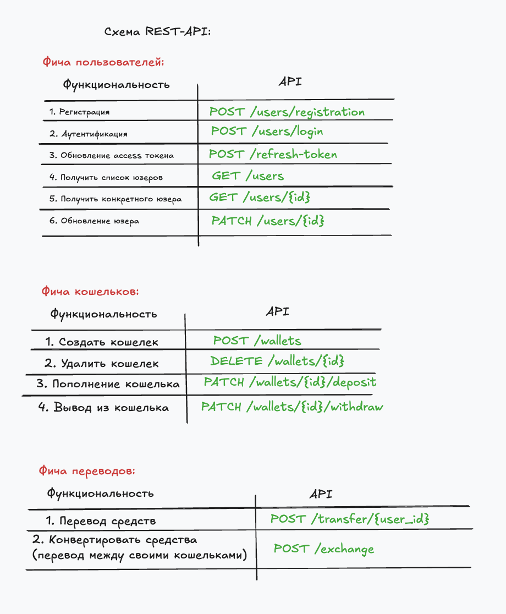

# WalletFlow — Платформа управления финансовыми операциями

## Описание продукта

**WalletFlow** — это backend-платформа для управления электронными кошельками пользователей с поддержкой мультивалютности, переводов между пользователями и конвертации валют по актуальному курсу.

Система состоит из двух микросервисов:
- **Wallet Service** (основной) — REST API для управления пользователями, кошельками и финансовыми операциями
- **Notification Service** — gRPC-сервис для отправки уведомлений о событиях (транзакции, пополнения, конвертации)

---

# Схема БД


---

# Схема REST-API


---
## Стек технологий

- Go
- PostgreSQL
- Redis
- Docker / Docker Compose
- HTTP REST (Wallet Service)
- gRPC (Notification Service)
- Внешний API курсов валют

---

## Бизнес-требования

### 1. Управление пользователями

- Регистрация пользователя (email, пароль, имя)
- Аутентификация по email + пароль (JWT passetto)
- Получение и обновление профиля
- Email должен быть уникальным
- Пароль — минимум 8 символов, хранить в хэшированном виде (bcrypt)
- JWT passetto access token — время жизни 15 минут
- JWT refresh token — время жизни 7 дней

### 2. Управление кошельками

- При регистрации пользователю автоматически создаётся кошелёк в валюте **RUB**
- Пользователь может создавать дополнительные кошельки в поддерживаемых валютах
- Поддерживаемые валюты: `RUB`, `USD`, `EUR`, `GBP`, `CNY`
- У одного пользователя **не может быть двух кошельков в одной валюте**
- Максимум **5 кошельков** на пользователя (по одному на каждую валюту)
- Кошелёк нельзя удалить, если на нём есть средства (баланс > 0)
- Баланс кошелька не может быть отрицательным

### 3. Пополнение кошелька (Deposit)

- Пользователь может пополнить любой свой кошелёк
- Минимальная сумма пополнения: **1 единица валюты**
- Максимальная сумма одного пополнения: **1 000 000 единиц валюты**
- После пополнения создаётся запись транзакции

### 4. Вывод средств (Withdraw)

- Пользователь может вывести средства с любого своего кошелька
- Нельзя вывести больше, чем есть на балансе
- Минимальная сумма вывода: **1 единица валюты**
- После вывода создаётся запись транзакции

### 5. Переводы между пользователями (Transfer)

- Пользователь может перевести средства другому пользователю
- Перевод возможен **только в одной валюте** — валюта кошелька отправителя и получателя должна совпадать
- Нельзя переводить самому себе
- Нельзя перевести больше, чем есть на балансе
- Минимальная сумма перевода: **1 единица валюты**
- Перевод должен быть **атомарным** — либо списание и зачисление проходят оба, либо ни одно
- Создаются **две записи транзакции** — списание у отправителя, зачисление у получателя

### 6. Конвертация валют (Exchange)

- Пользователь может конвертировать средства между **своими** кошельками разных валют
- Курс берётся из внешнего API в реальном времени
- Кэширование курса в Redis — **TTL 10 минут**
- Если внешний API недоступен — использовать последний закэшированный курс
- Если кэш пуст и API недоступен — отклонить операцию с ошибкой
- Минимальная сумма конвертации: **1 единица исходной валюты**
- Операция должна быть **атомарной**
- Создаются **две записи транзакции** — списание с одного кошелька, зачисление на другой

**Внешний API для курсов (на выбор):**
- https://github.com/fawazahmed0/exchange-api (бесплатный, без ключа)
- https://open.er-api.com/ (бесплатный, без ключа)
- Или любой другой бесплатный API курсов валют

### 7. История транзакций

- Пользователь может просматривать историю транзакций по конкретному кошельку
- Пагинация обязательна (limit / offset или cursor-based)
- Фильтрация по:
  - типу транзакции (`deposit`, `withdraw`, `transfer_in`, `transfer_out`, `exchange_in`, `exchange_out`)
  - дате (от — до)
- Сортировка по дате (новые первыми по умолчанию)
- Каждая транзакция содержит: сумму, тип, дату, ID связанного пользователя (для переводов), курс (для конвертации)

### 8. Сервис уведомлений (Notification Service)

Отдельный микросервис, взаимодействует с Wallet Service по **gRPC**.

- Wallet Service отправляет событие в Notification Service при:
  - Успешном пополнении
  - Успешном выводе
  - Входящем переводе
  - Исходящем переводе
  - Конвертации валют
- Notification Service логирует уведомления в свою таблицу в БД (можно в ту же PostgreSQL или отдельную)
- Notification Service предоставляет gRPC endpoint для получения списка уведомлений пользователя
- Wallet Service проксирует этот endpoint через REST (GET /api/v1/notifications)
- **Отправка уведомления не должна блокировать основную операцию** — если Notification Service недоступен, транзакция всё равно должна пройти (fire-and-forget или асинхронно)

### 9. Rate Limiting

- Глобальный лимит: **100 запросов в минуту** на одного пользователя
- Реализовать через Redis (sliding window или token bucket)
- При превышении лимита — возвращать HTTP 429 Too Many Requests

---

## Нефункциональные требования

### API

- REST API с версионированием: `/api/v1/...`
- Формат данных: JSON
- Все денежные суммы передавать как **строки** (для избежания проблем с плавающей точкой), хранить в БД как `DECIMAL` / `NUMERIC`
- Корректные HTTP-коды ответов (200, 201, 400, 401, 403, 404, 409, 422, 429, 500)
- Единый формат ошибок:
  ```json
  {
    "error": {
      "code": "INSUFFICIENT_FUNDS",
      "message": "Not enough funds on the wallet"
    }
  }
  ```

### Безопасность

- Все эндпоинты кроме регистрации и логина требуют JWT
- Пользователь может работать **только со своими** ресурсами
- Refresh token хранить в БД (возможность отозвать)

### Хранение данных

- Все финансовые операции должны использовать **транзакции БД**
- Операции перевода и конвертации — **serializable или repeatable read** уровень изоляции
- Все временные метки хранить в **UTC**

### Docker

- `docker-compose.yml` для поднятия всей системы
- Сервисы: `wallet-service`, `notification-service`, `postgres`, `redis`
- Каждый Go-сервис — свой `Dockerfile` (multi-stage build)
- Должно работать по `docker-compose up --build`

### Конфигурация

- Через переменные окружения или конфиг-файл
- Никаких захардкоженных значений (порты, строки подключения к БД, секреты)

### Миграции

- SQL-миграции для создания схемы БД
- Применяются автоматически при запуске или отдельной командой

---

## Ограничения и краевые случаи (обрати внимание)

1. **Гонки данных**: два одновременных списания с одного кошелька не должны привести к отрицательному балансу
2. **Идемпотентность**: повторный запрос на перевод с одним и тем же idempotency key не должен создать дублирующую транзакцию (опционально, но рекомендуется)
3. **Округление**: при конвертации валют результат округлять до **2 знаков** после запятой (банковское округление)
4. **Самоперевод**: перевод самому себе — ошибка, но конвертация между своими кошельками — нет
5. **Каскадные ошибки**: недоступность Notification Service не должна ломать Wallet Service
6. **Graceful shutdown**: корректное завершение сервисов (дождаться завершения активных запросов)

---

## Предлагаемая структура проекта (рекомендация, не обязательно)

```
├── wallet-service/
│   ├── cmd/
│   ├── internal/
│   ├── migrations/
│   ├── Dockerfile
│   └── ...
├── notification-service/
│   ├── cmd/
│   ├── internal/
│   ├── Dockerfile
│   └── ...
├── proto/
│   └── notification.proto
├── docker-compose.yml
└── README.md
```

---

## Критерии приёмки

Когда ты решишь что проект готов — напиши мне, и я проведу проверку по следующим критериям:

1. **Запуск**: `docker-compose up --build` поднимает всю систему без ошибок
2. **API**: все описанные эндпоинты работают корректно
3. **Бизнес-логика**: ограничения соблюдены (баланс, лимиты, атомарность)
4. **gRPC**: Notification Service работает и доступен для Wallet Service
5. **Redis**: кэширование курсов и rate limiting работают
6. **БД**: миграции применяются, данные консистентны
7. **Docker**: multi-stage builds, compose работает
8. **Код**: чистая структура, обработка ошибок, нет хардкода

---

*Удачи! Проектируй схему БД, API-контракты и архитектуру самостоятельно. Это и есть главная ценность задания.*

* copilot --resume=c52d8f05-b9da-4a5d-b911-2d648a3faad5